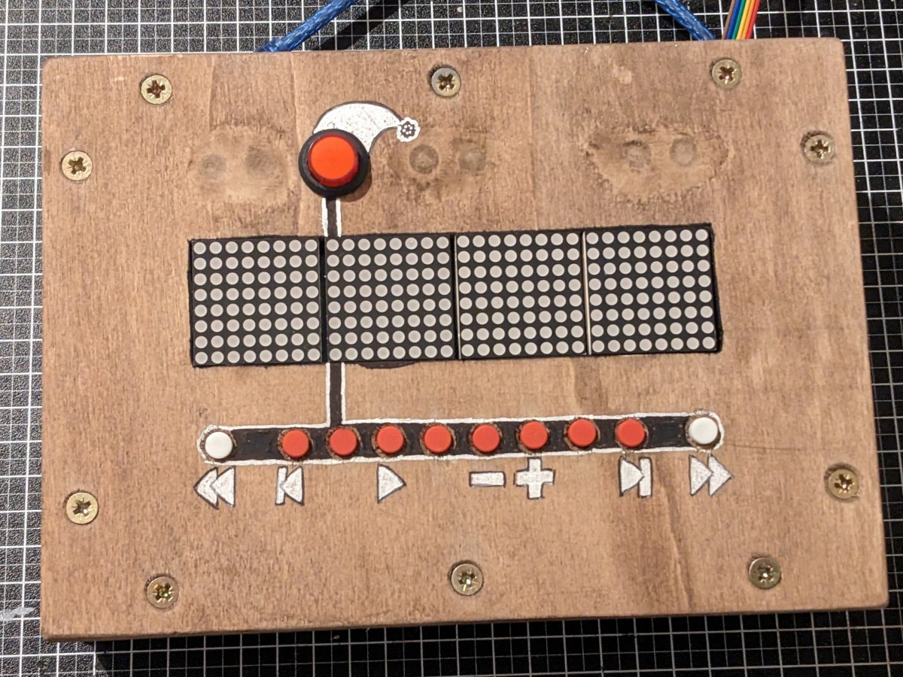
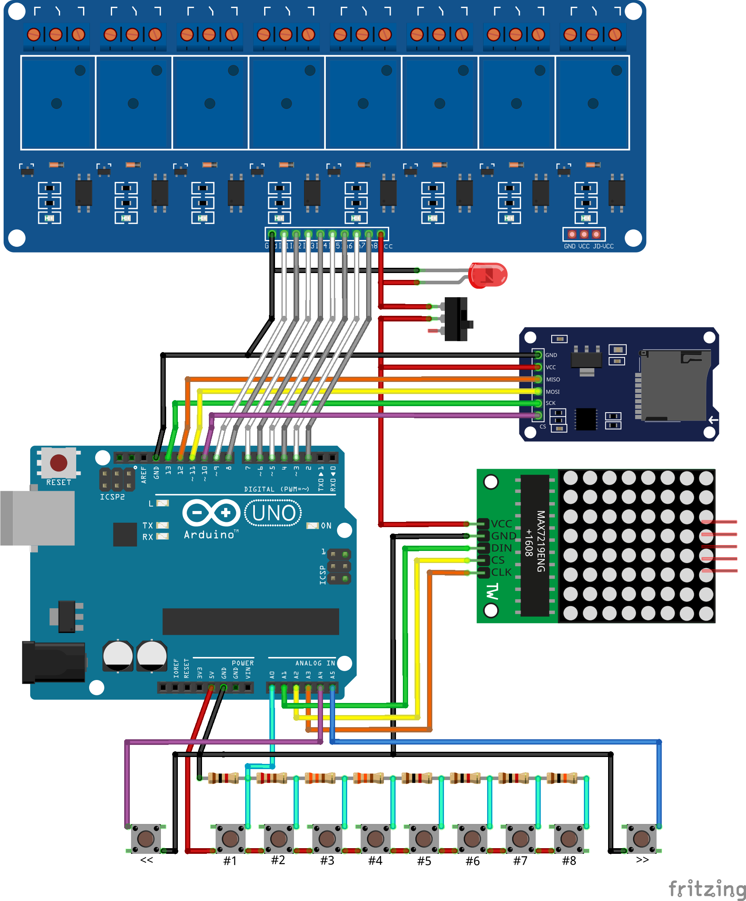

# Arduino Light Controller

Demo-Video: https://youtu.be/tLJh8Uo7GBw

---

[EN] Allows you to create and edit an 8 channel sequence of flexible length on an arduino and play back the sequence on 8 relais. Connect these relais to power sockets and you can plug in any christmas lights to make them dance along.

More details (in German) on [my website here](https://www.brickup.de/2024/weihnachtslicht-steuerung↗).

---

[DE] Erstelle und bearbeite eine 8-Kanal-Sequenz flexibler Länge auf einem Arduino und spiele sie auf acht Relais ab. Schließe Steckdosen an die Relais an, damit du beliebige Lichterketten im Takt der Sequenz leuchten lassen kannst.

Mehr Details auf [meiner Webseite hier](https://www.brickup.de/2024/weihnachtslicht-steuerung↗).

---

